# DesignSafe Use Case Template

## A guide to adding your use case project

1. The PI should Fork the DS Use Case template from the GitHub [repo](https://github.com/DesignSafe-CI/DS_Use_Case_template/) to their own account. If prompted, select an organziation to create the fork.

    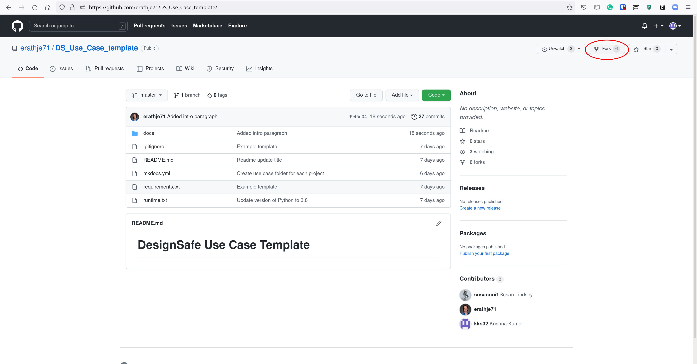

    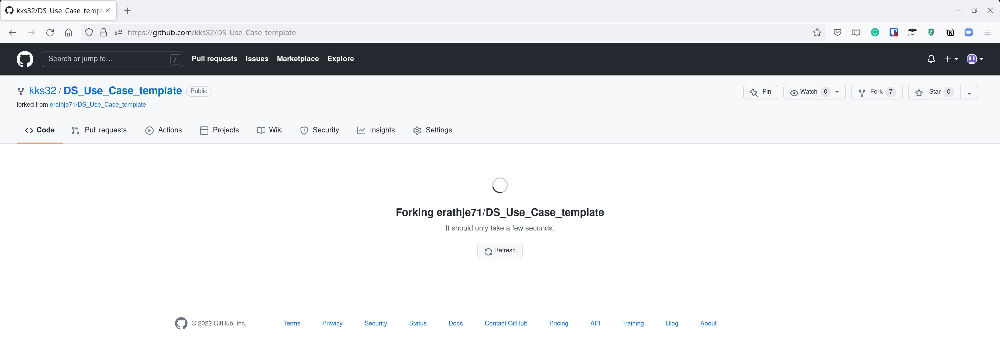

    
    The PI can later add their students as collaborators in the settings page: 
    
    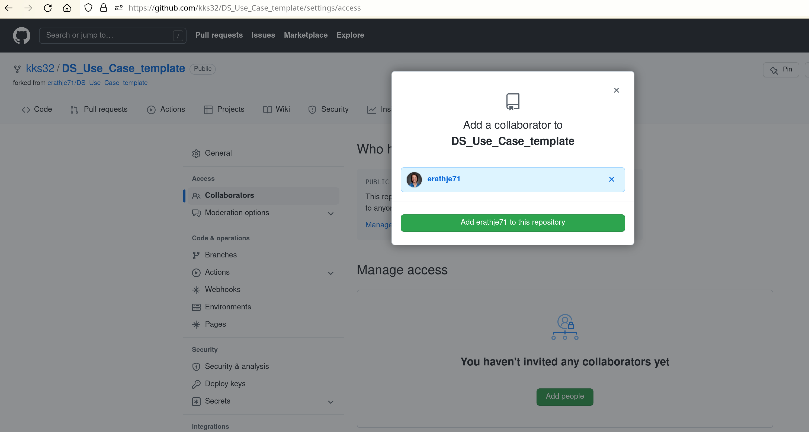

1. GitHub will create a forked repo in your user account. Note, the new repo will say it was forked from the original [https://github.com/DesignSafe-CI/DS_Use_Case_template/](https://github.com/DesignSafe-CI/DS_Use_Case_template/).
    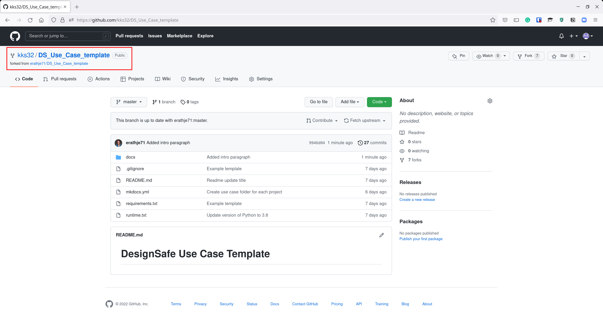

1. Navigate to your use case folder, which is located in the `docs` folder. The folders are named after the PI, so find the folder with your name to edit your template. **Always check you are only editing your use case folder**.
    

1. Click on the `usecase.md` file in your usecase folder to edit your usecase. 
    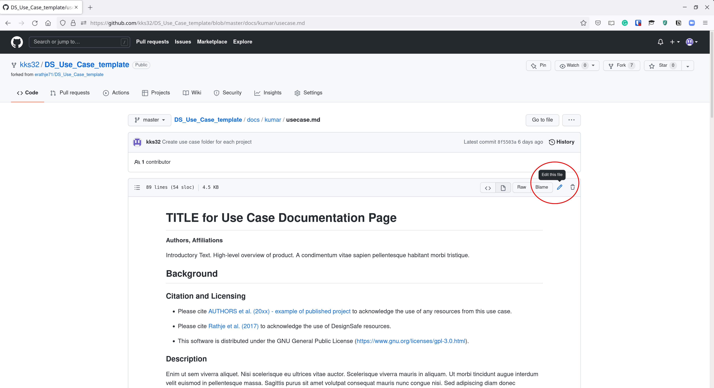

    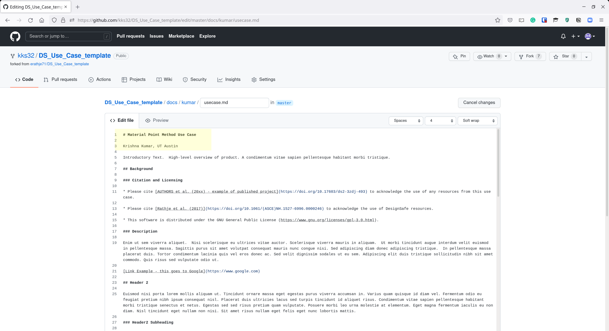

1. Once you have completed editing your use case, you save your changes by commiting. Scroll down to the bottom of the page and type a descriptive phrase explaining the changes you have made and click "Commit changes". These changes will be saved only on your repo and will not be reflected in the original DS Use Case repository until you create a pull request.

    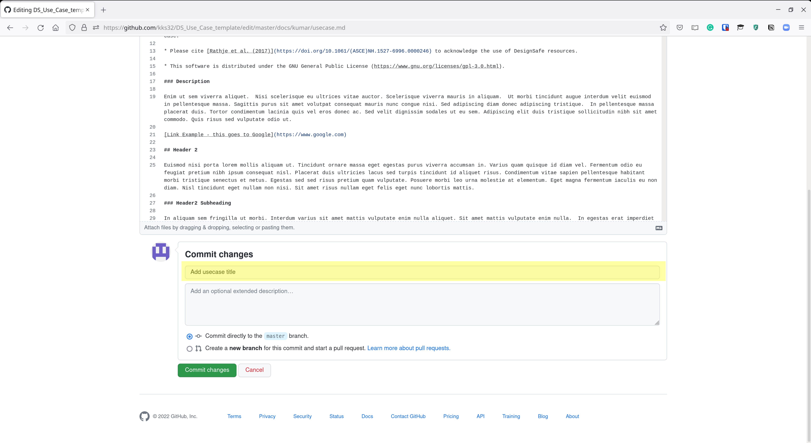

1. To add images to your use case, navigate to your use case folder and select `img` folder. **Ensure that you are in your usecase `img` folder** before adding images.

    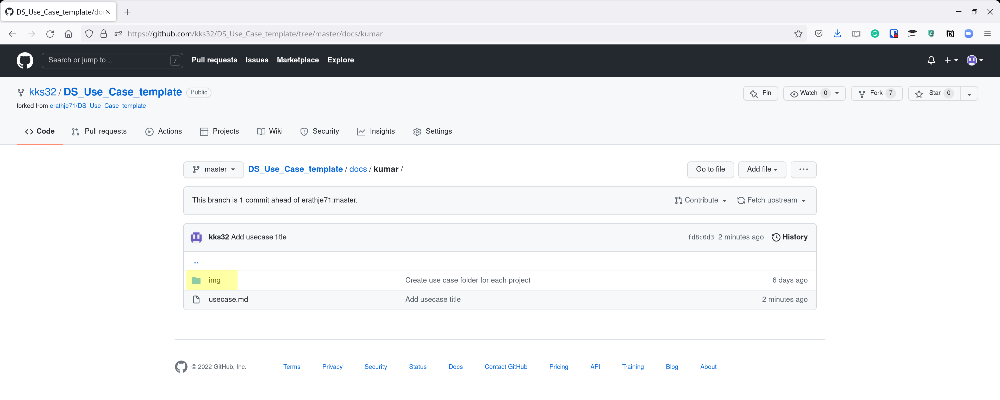
    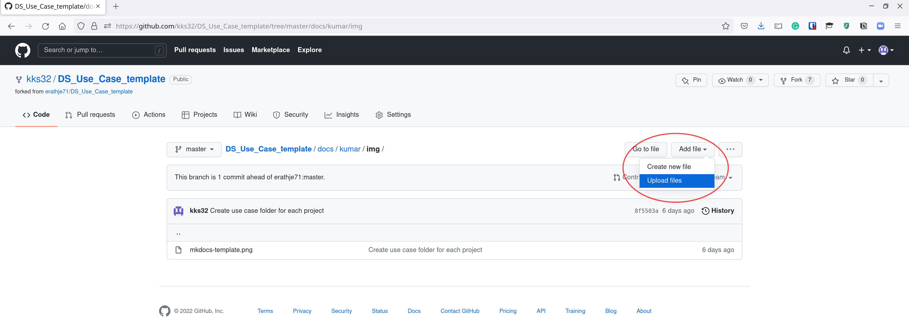

1. Select image files (you can select multiple files) and click add. Once the images are added as shown below, type a descriptive commit message and click `Commit Changes` to add relevant images to your folder. 

    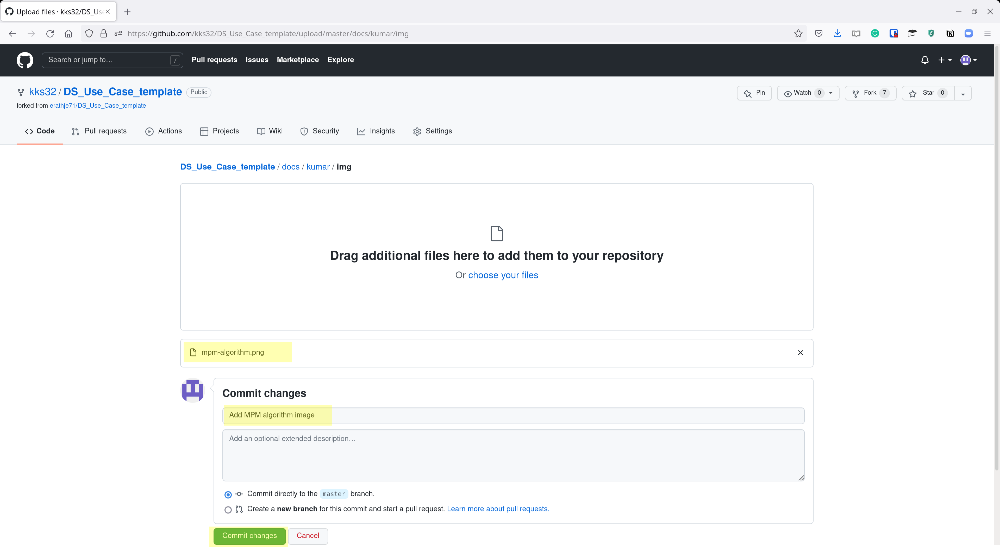

1. To insert the image in your `usecase.md` file, use the following command:
    ```
    
    ```
   In this case, we added an image called `mpm-algorithm.png`, which is located in the use case folder `img`. We can reference it in the text using:
    ```
    
    ```
   > Note: Use relative path `img/mpm-algorithm.png`, **do not use full paths** (e.g., "https://github.com/kks32/DS_Use_Case_Template/docs/kumar/img/mpm-algorithm.png").

   You can use the preview tab to check images and text formatting before commiting your changes. 

   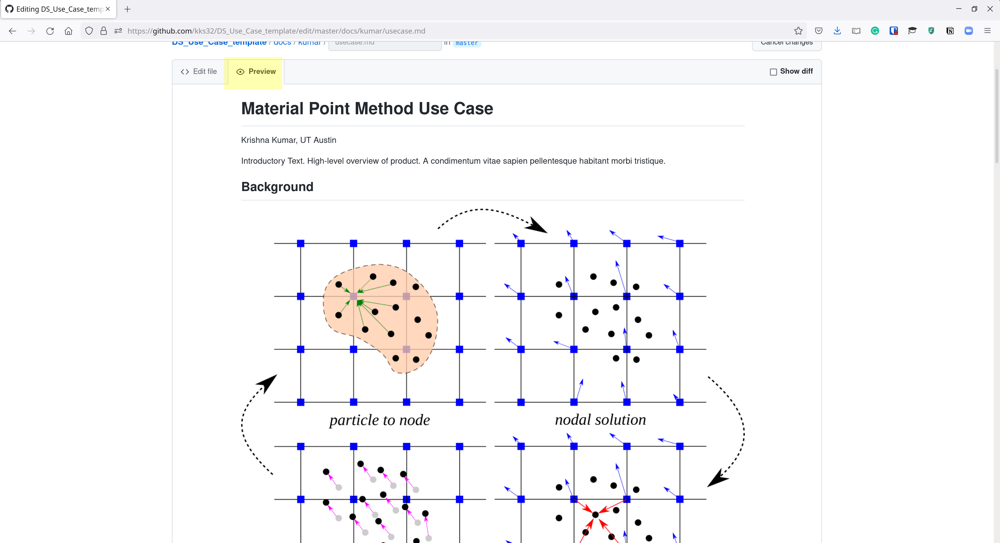

   Commit your changes to GitHub with a meaningful message.

   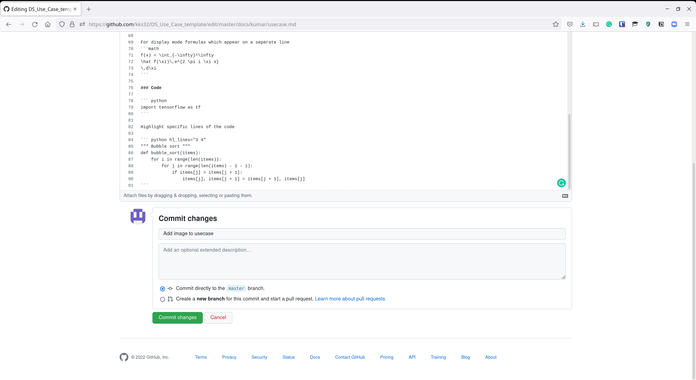

1. Before you are ready to make changes to the original DS Use Case repo. Make sure your repository on GitHub is up to date with all the changes from the original repo. You can do this by navigating your repo and click on `Fetch upstream`. It should say nothing new to fetch. 
    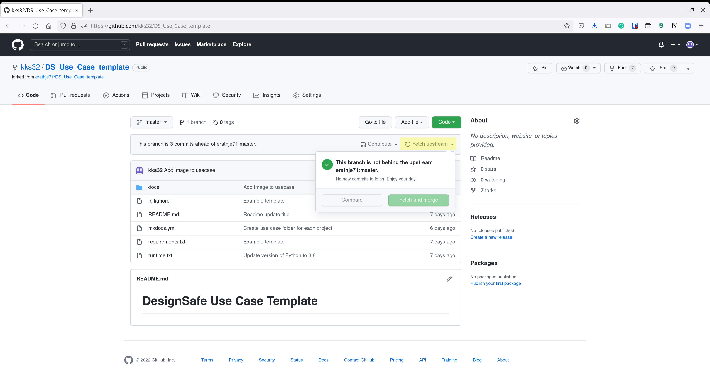

    If there are any new changes you can fetch and merge.
    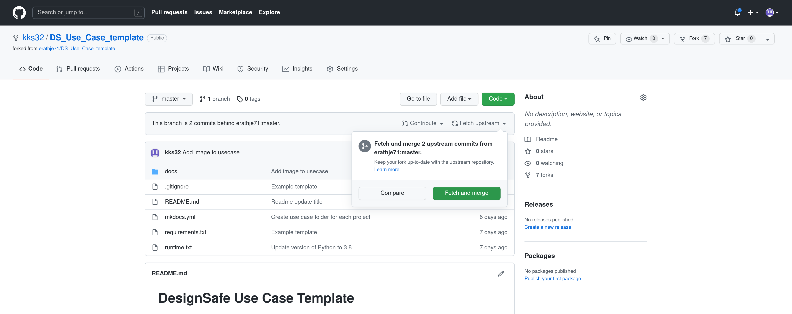

1. Once you have completed making changes, you'll now create a Pull Request (PR) to request that your changes be merged to the main DesignSafe Use Case repo. Go to your repo on GitHub (in my case it is [https://github.com/kks32/DS_Use_Case_Template](https://github.com/kks32/DS_Use_Case_Template)). And select `Contribute`, check if it says `This branch is XX comits **ahead** of DesignSafe-CI master`, before opening a pull request:

    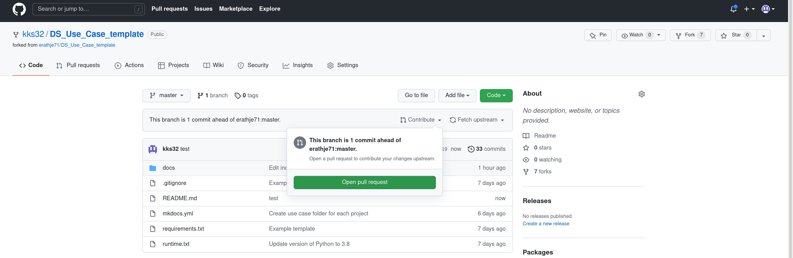

    Complete the title and description of your PR and select `Create Pull Request`:

    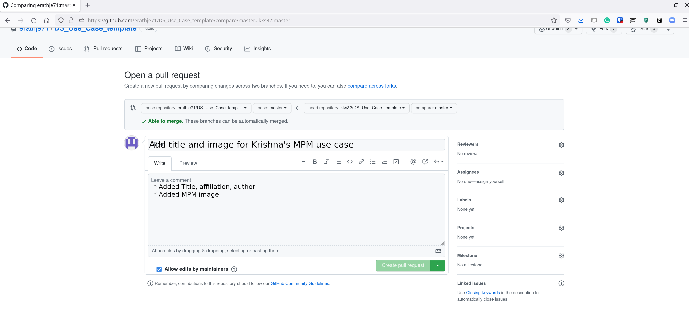

    The PR will show all the changes you have made in the `Files Changed` tab:

    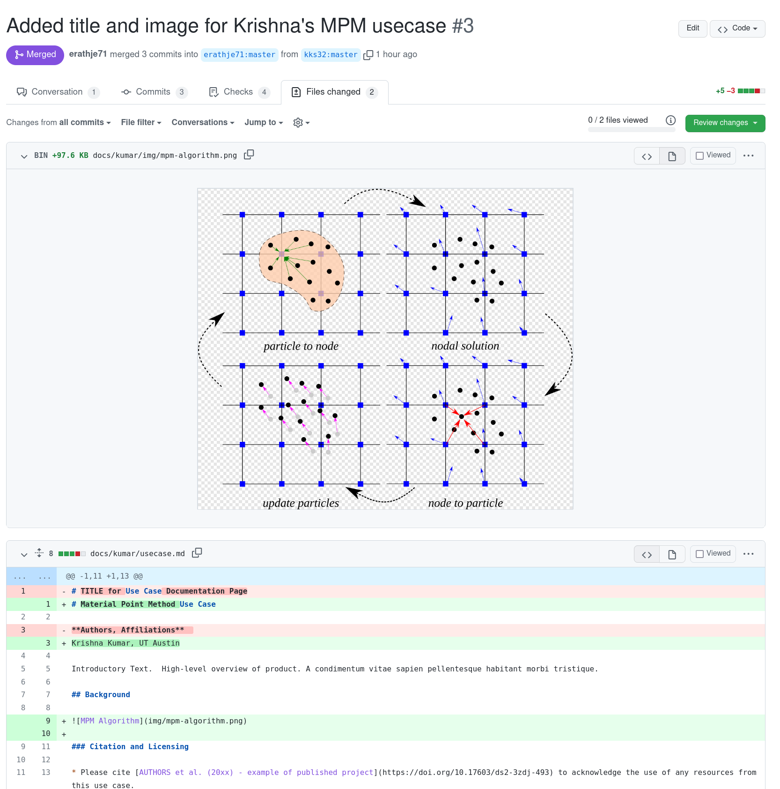

1. After a minute or so a preview deployment of your use case will be available on the pull request page. Select the preview link generated by Netlify to view your changes similar to how it would be rendered in the final version. If you want to make some tweaks. Visit *your* GitHub repo of the DS Use Case and make changes. As long as the current PR remains open GitHub will automatically pull your changes. 

    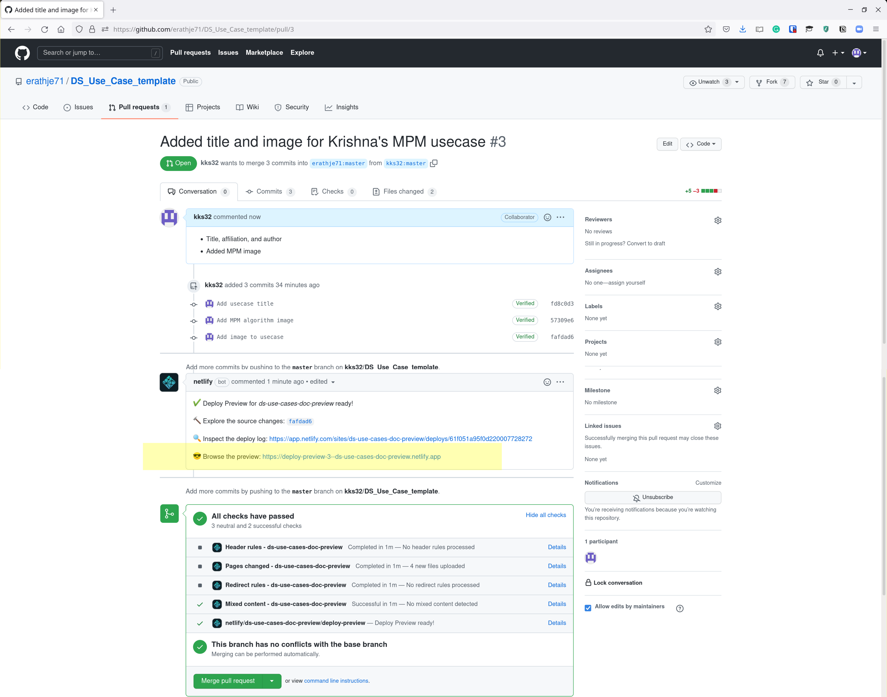

    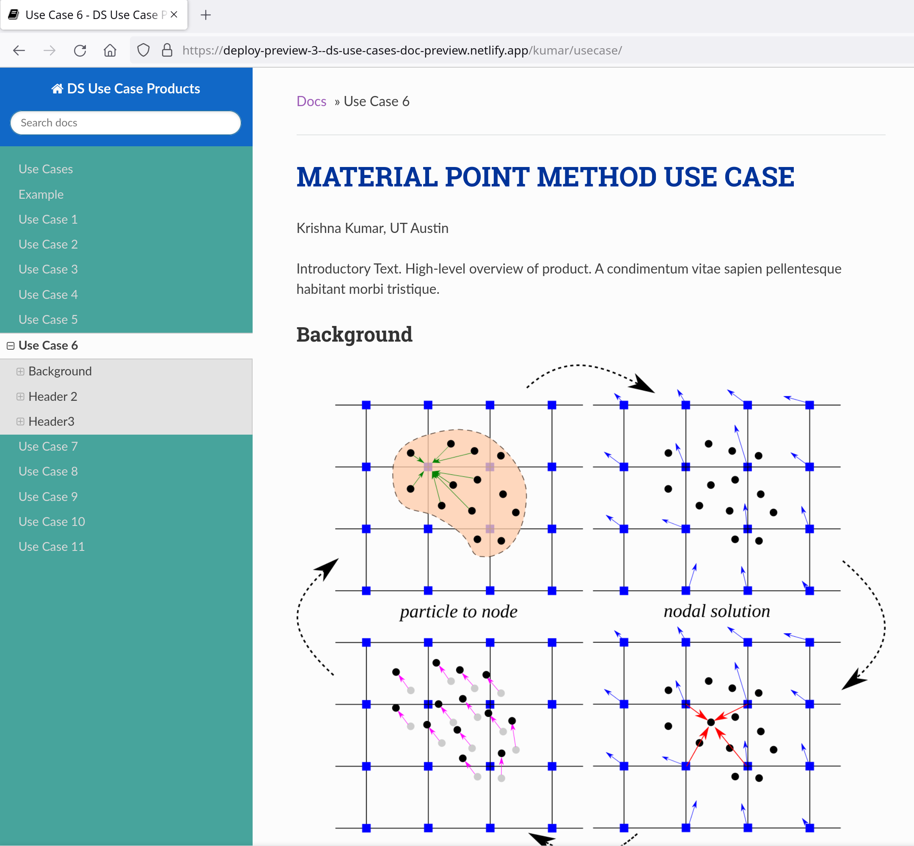
