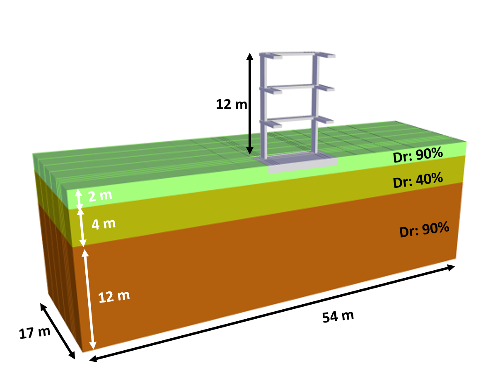
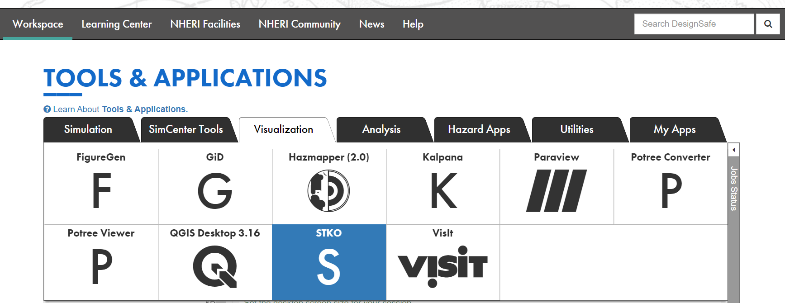
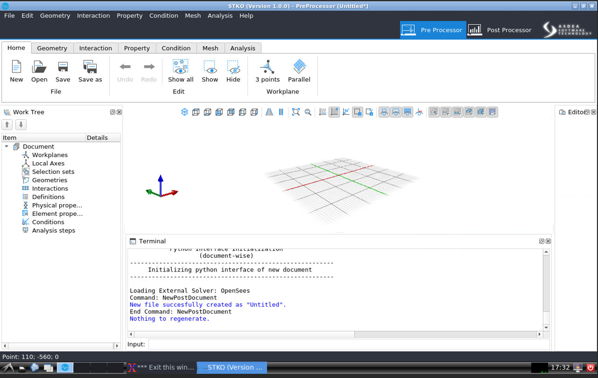
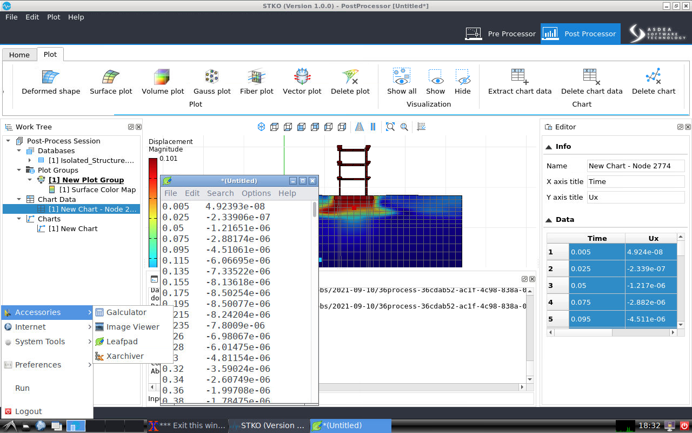
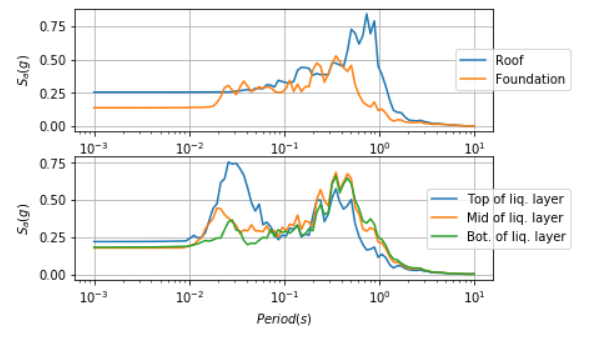
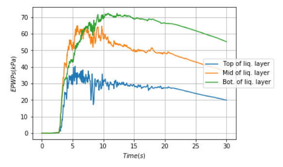
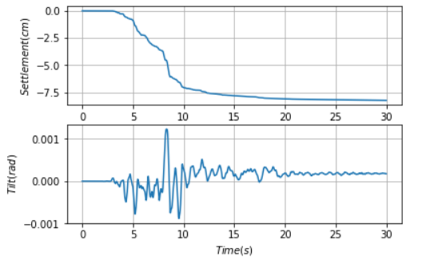

# Integration of OpenSees-STKO-Jupyter to Simulate Seismic Response of Soil-Structure-Interaction
**Yu-Wei Hwang and Ellen Rathje - University of Texas at Austin**  

This use case example shows how to run an OpenSeesMP analysis on the high-performance computing (HPC) resources at [DesignSafe](https://www.designsafe-ci.org) (DS) using the [STKO](https://asdeasoft.net/?product-stko) graphical user interface and a Jupyter notebook. The example also post-processes the output results using python scripts, which allows the entire analysis workflow to be executed within DesignSafe without any download of output.  The example makes use of the following DesignSafe resources:

[Simulation on DS - OpenSees](https://www.designsafe-ci.org/rw/workspace/#!/OpenSees::Simulation)<br/> 
[Visualization on DS - STKO](https://www.designsafe-ci.org/rw/workspace/#!/stko-ds-exec-01-1.0.0u1)<br/>
[Jupyter notebooks on DS Juypterhub](https://www.designsafe-ci.org/rw/workspace/#!/Jupyter::Analysis)<br/>


## Background 

### Citation and Licensing  

* Please cite [Hwang et al. (2021)](https://ascelibrary.org/doi/abs/10.1061/%28ASCE%29GT.1943-5606.0002546) to acknowledge the use of any resources from this use case.

* Please cite [Rathje et al. (2017)](https://doi.org/10.1061/(ASCE)NH.1527-6996.0000246) to acknowledge the use of DesignSafe resources.  

* This software is distributed under the GNU General Public License (http://www.gnu.org/licenses/gpl-3.0.html). 

### Description  

A hypothetical three dimensional soil–foundation– structure system on liquefiable soil layer is analyzed using OpenSees MP. The soil profile first included a 12-m thick dense sand layer with Dr of 90%, followed by a 4-m thick loose sand layer with Dr of 40%, and overlaid by a 2-m thick dense sand layer. The ground water table was at ground surface. An earthquake excitation was applied at the bottom of the soil domain under rigid bedrock conditons. A three-story, elastic structure was considered on a 1-m-thick mat foundation.The foundation footprint size (i.e., width and length) was 9.6m x 9.6m with bearing pressure of 65 kPa. Additional information cane be found in [Hwang et al. (2021)](https://ascelibrary.org/doi/pdf/10.1061/%28ASCE%29GT.1943-5606.0002546?casa_token=VvVOt4ua4GAAAAAA:f_aX-l0Jn0UwtpJf_0SfF323zdh7edMKxb3ou635HE5obgmO7amjFMkmLArlLE-LDM6MBfVCMPSh)



The use case workflow involves the following steps:
* Creating the OpenSees input files using STKO.
* Submitting the OpenSees job to the Stampede2 HPC resources at DesignSafe/TACC.
* Post-processing the results using STKO and python.


## Create OpenSees Model using STKO

* The user can create the input OpenSees-STKO model (both the 'main.tcl' and 'analysis_steps.tcl' files, as well as the '\*.cdata' files) using [STKO](https://asdeasoft.net/?product-stko), which is available from the Visualization tab of the Tools & Applications section of the DesignSafe Workspace.
* Save all the files (tcl script and mpco.cdata files) in a folder under the user's My Data directory within the Data Depot.
* Alternatively, the input OpenSees-STKO model can be created on the user's local computer and all the files uploaded to a My Data folder.





## Setup and submit OpenSees job via Jupyter notebook

A Jupyter notebook, [SSI_MainDriver.ipynb](https://www.designsafe-ci.org/data/browser/public/designsafe.storage.community/Use%20Case%20Products/OpenSees-STKO), is provided that submits a job to the STKO compatible version of OpenSeesMP.

This Jupyter notebook utilizes the input file 'main.tcl', as well as 'analysis_steps.tcl' and the associated '\*.cdata' files created by STKO.  All of these files must be located in the same folder within the My Data directory of the DesignSafe Data Depot.

### Setup job description
This script demonstrates how to use the [agavepy SDK](https://agavepy.readthedocs.io/en/master/) that uses the TAPIS API to setup the job description for the OpenSeesMP (V 3.0) App that is integrated with STKO. More details of using TAPIS API for enabling workflows in Jupyter notebook can be found in the DesignSafe webinar: [Leveraging DesignSafe with TAPIS](https://youtu.be/-_1lNWW8CAg?t=1854)

* The user should edit the "job info" parameters as needed. 
   * The "control_jobname" should be modified to be meaningful for your analysis.
   * The "control_processorsnumber" should be equal to the "number of partitions" in the STKO model. 

```python
from agavepy.agave import Agave
ag = Agave.restore()
import os

## Running OPENSEESMP (V 3.0)-STKO ver. 3.0.0.6709
app_name = 'OpenSeesMP'
app_id = 'opensees-mp-stko-3.0.0.6709u1'
storage_id = 'designsafe.storage.default'

### One can revise the following job info ####
control_batchQueue = 'normal'
control_jobname = 'SSI_NM_Northridge_0913'
control_nodenumber = '1'
control_processorsnumber = '36'
control_memorypernode = '1'
control_maxRunTime = '24:00:00'
```

### Submit and Run job on DesignSafe
The script below submits the job to the HPC system.  
```python
from agavepy.async import AgaveAsyncResponse
job = ag.jobs.submit(body=job_description)
asrp = AgaveAsyncResponse(ag, job)
```
The command below shows the status of the user's analysis.
```python
asrp.result()
```
### Identify Job ID and Archived Location

After completing the analysis, the results are saved to an archive directory.  This script fetches the jobID and identifies the path of the archived location on DS.
```python
jobinfo = ag.jobs.get(jobId=job.id)
jobinfo.archivePath
user = jobinfo.archivePath.split('/', 1)[0]
```
This command displays the path of your archived location on DS.  When used with your analysis, it will show the location of your results, and not the path below. 
```python
jobinfo.archivePath
'$username/archive/jobs/job-3511e755-cb3f-4e3e-92b9-615cc40d39e6-007'
```
## Post-processing on DesignSafe

The output from an OpenSeesMP-STKO analysis are provided in a number of '\*.mpco' files, and these files can be visualized and data values extracted using STKO.  Additionally, the user can manually add recorders to the 'analysis_steps.tcl' file created by STKO and the output from these recorders will be saved in \*.txt files.  These \*.txt can be imported into Jupyter for post-processing, visualization, and plotting.


### Visualize and extract data from STKO
After the job is finished, the user can use [STKO](https://www.designsafe-ci.org/rw/workspace/#!/stko-ds-exec-01-1.0.0u1) to visualize the results in the '\*.mpco' files that are located in the archive directory. If the user would like to extract data from the GUI of STKO, they can copy and paste the data using the "Leafpad" text editor within the DS virtual machine that serves STKO.  The user can then save the text file to a folder within the user's My Data directory.



### Example post-processing scripts using Jupyter

A separate Jupyter notebook is provided ([Example post-processing scripts.ipynb.ipynb](https://www.designsafe-ci.org/data/browser/public/designsafe.storage.community/Use%20Case%20Products/OpenSees-STKO)) that post-processes data from OpenSees recorders and save in \*.txt files.  The Jupyter notebook is set up to open the \*.txt files after thay have been copied from the archive directory to the same My Data in which the notebook resides. 

For this example, recorders are created to generate output presented in terms of:
* Acceleration response spectra at the mid of loose sand layer, foundation, and roof.
* Evolution of excess pore water pressure at the bottom, mid, and top of the loose sand layer.
* Time history of foundation settlement and tilt.

#### Creating recorders

To manually add the recorders, the user needs to first identify the id of the nodes via STKO (see StruList and SoilList below) and their corresponding partition id (i.e., Process_id). These recorders should be added into the "analysis_steps.tcl" before running the model. Note that the "analysis_steps.tcl" is automatically generated by STKO.  

```python
if {$process_id == 20} {
set StruList {471 478 481}
eval "recorder Node -file $filename.txt -time -node $StruList -dof 1 3 -dT $timestep disp"
eval "recorder Node -file $filename.txt -time -node $StruList -dof 1 -dT $timestep accel"

set SoilList {2781}
eval "recorder Node -file $filename.txt -time -node $SoilList -dof 1 3 -dT $timestep disp"
eval "recorder Node -file $filename.txt -time -node $SoilList -dof 1 -dT $timestep accel"
eval "recorder Node -file $filename.txt -time -node $SoilList -dof 4 -dT $timestep vel"
}
```

### Example Post-processing Results
This section shows the results from the post-processing scripts performed via the Jupyter notebook. The notebook is broken into segments with explanations of each section of code.  Users should edit the code to fit their own needs.   
 
**Response spectra for motions at various locations within the model**


**Time history of excess pore pressure at different locations in the soil**


**Time history of foundation settlement and tilt**

  
